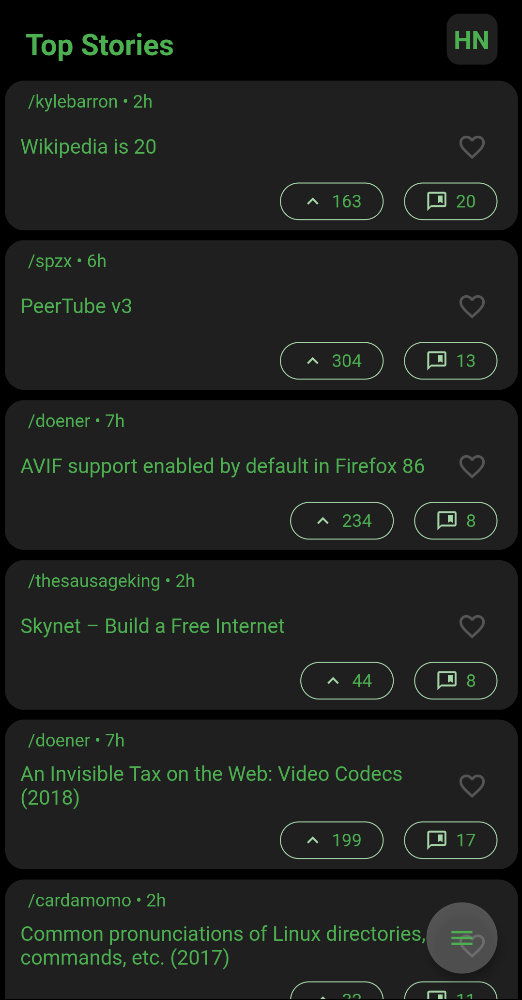
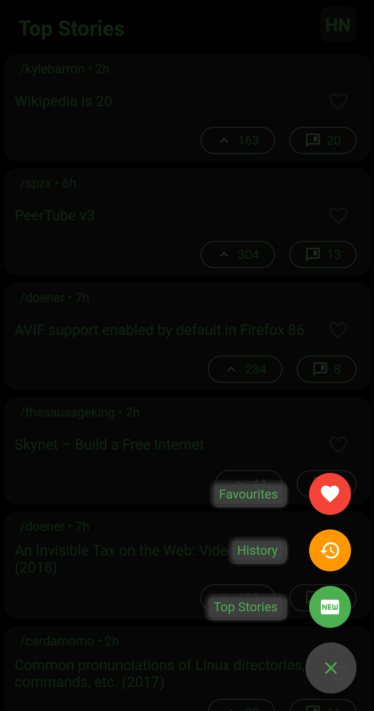
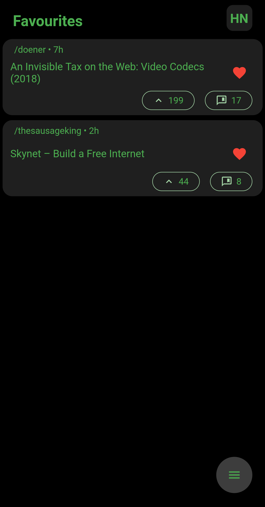

# Hacker-News-App

## Images
   

---

## Description
- This app uses hacker news api to fetch top stories
- When user clicks on news, it is opened in browser pf device
- History is saved in 'History Page'
- User can mark stories as favourites which in displayed in 'Favourites Page'
- User can switch between this Pages using floatin action button at bottom right(Speed Dial)